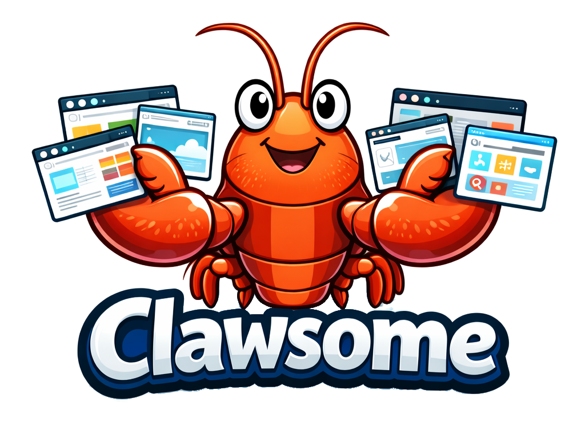

<p align="center">
  
</p>

<h3 align="center">Live browser automation dashboard powered by Playwright</h3>

<p align="center">
  <a href="https://www.python.org/"></a>
  <a href="https://fastapi.tiangolo.com/"></a>
  <a href="https://playwright.dev/python/"></a>
  <a href="https://github.com/alexanderbailey/clawsome/blob/main/LICENSE"></a>
  <a href="https://github.com/astral-sh/uv"></a>
  <a href="https://hub.docker.com/"></a>
</p>

<p align="center">
  <a href="#quick-start">Quick Start</a> &middot;
  <a href="#rest-api">API Reference</a> &middot;
  <a href="#example-setups">Example Setups</a> &middot;
  <a href="#playwright-test-integration">Test Integration</a> &middot;
  <a href="#docker">Docker</a>
</p>

---

Clawsome is a browser automation service you control over a REST API — from any AI agent that can shell out to `curl` (OpenClaw, Claude Code, a custom script), or from your own tooling directly. It runs headless Chromium, exposes a REST API for browser control, and serves a real-time dashboard with live screenshots via WebSocket and SSE.

**Two main use cases:**

- **AI-driven browser tasks** — an agent creates a context, drives it through the API, and you watch the task happen live on the dashboard. [OpenClaw](https://openclaw.ai) and Claude Code are two examples below; anything that can run `curl` works the same way.
- **Playwright test monitoring** — run your test suite normally and watch every test live on the dashboard with real-time screenshots and logs

Runs anywhere Python and Chromium can — no particular OS or hardware assumed.

## Quick Start

### 1. Clone and install

```bash
git clone https://github.com/alexanderbailey/clawsome.git
cd clawsome
uv sync
uv run playwright install chromium
```

### 2. Configure environment

```bash
cp .env.example .env
```

Defaults are fine for local use (`PORT=3000`, `HOST=0.0.0.0`).

### 3. Run the server

```bash
# Development (auto-restarts on file changes)
uv run uvicorn src.app:app --host 0.0.0.0 --port 3000 --reload

# Production
uv run uvicorn src.app:app --host 0.0.0.0 --port 3000
```

### 4. Verify

```bash
curl http://localhost:3000/health
# {"status":"ok"}
```

Open [http://localhost:3000/summary](http://localhost:3000/summary) for the live dashboard.

## Docker

```bash
cp .env.example .env
docker compose up --build
```

Data and profiles are persisted via volumes (`./data` and `./profiles`).

## Architecture

```
                         ┌──────────────────┐
   Agent / curl ────────►│   REST API       │
                         │   /api/contexts  │
                         └────────┬─────────┘
                                  │
                    ┌─────────────┼─────────────┐
                    ▼             ▼              ▼
              ┌──────────┐ ┌──────────┐  ┌────────────┐
              │ Browser  │ │  SQLite  │  │    SSE     │
              │ Contexts │ │   DB     │  │ Broadcast  │
              └────┬─────┘ └──────────┘  └─────┬──────┘
                   │                           │
                   ▼                           ▼
              ┌──────────┐             ┌──────────────┐
              │Playwright│             │  Dashboard   │
              │ Chromium │             │  HTMX + WS   │
              └──────────┘             └──────────────┘
```

**Context lifecycle:** Create &rarr; Navigate / Execute &rarr; Screenshot &rarr; Log &rarr; Destroy

**Context types:**
| Type | Description |
| --- | --- |
| **Ephemeral** | Fresh context in the shared browser instance (default) |
| **Persistent** | Uses a profile directory with stored cookies/sessions |
| **External** | Metadata-only — no browser. Screenshots pushed via API (used by the test fixture) |

## Browser Profiles

Profiles save login sessions so Clawsome can access authenticated sites without re-entering credentials.

```bash
uv run python -m src.browser.create_profile amazon
```

This opens a visible Chromium window. Log in manually, then close the browser. The session is saved to `./profiles/amazon/`.

Use it when creating a context:

```json
{ "name": "check prices", "profile": "amazon" }
```

## REST API

All endpoints are under `/api/`.

### Contexts

| Method | Endpoint | Body | Description |
| --- | --- | --- | --- |
| `POST` | `/api/contexts` | `{ name, profile?, external? }` | Create a browser context |
| `GET` | `/api/contexts` | — | List all contexts |
| `GET` | `/api/contexts/:id` | — | Get context details |
| `DELETE` | `/api/contexts/:id` | — | Destroy context and free resources |

### Browser Actions

| Method | Endpoint | Body | Description |
| --- | --- | --- | --- |
| `POST` | `/api/contexts/:id/goto` | `{ url }` | Navigate to a URL |
| `POST` | `/api/contexts/:id/exec` | `{ action, selector?, value?, script? }` | Execute a page action |

<details>
<summary>Supported exec actions</summary>

| Action | Requires | Description |
| --- | --- | --- |
| `click` | `selector` | Click an element |
| `type` | `selector`, `value` | Fill a text field |
| `select` | `selector`, `value` | Choose a dropdown option |
| `wait` | `selector` | Wait for an element to appear |
| `evaluate` | `script` | Run JavaScript in the page |

</details>

### Screenshots & Logs

| Method | Endpoint | Body | Description |
| --- | --- | --- | --- |
| `GET` | `/api/contexts/:id/screenshot` | — | Get current screenshot (PNG) |
| `POST` | `/api/contexts/:id/screenshot` | Raw PNG body | Upload screenshot (external contexts) |
| `GET` | `/api/contexts/:id/screenshots` | — | List saved screenshot filenames |
| `GET` | `/api/contexts/:id/screenshots/:file` | — | Get a saved screenshot |
| `GET` | `/api/contexts/:id/logs` | — | Get log entries |
| `POST` | `/api/contexts/:id/logs` | `{ level?, message }` | Append a log entry |

### Example workflow

```bash
# Create a context
curl -s -X POST http://localhost:3000/api/contexts \
  -H "Content-Type: application/json" \
  -d '{"name": "example task"}'
# → {"id": "abc123", ...}

# Navigate
curl -s -X POST http://localhost:3000/api/contexts/abc123/goto \
  -H "Content-Type: application/json" \
  -d '{"url": "https://example.com"}'

# Click a link
curl -s -X POST http://localhost:3000/api/contexts/abc123/exec \
  -H "Content-Type: application/json" \
  -d '{"action": "click", "selector": "a.more-info"}'

# Take a screenshot
curl -s http://localhost:3000/api/contexts/abc123/screenshot -o shot.png

# Clean up
curl -s -X DELETE http://localhost:3000/api/contexts/abc123
```

## Playwright Test Integration

Clawsome includes a Playwright test fixture (`reporter/fixture.js`) that streams live screenshots and test progress to the dashboard. Your tests run as normal — Clawsome just watches.

### Setup

Import `test` and `expect` from the fixture instead of `@playwright/test`:

```js
import { test, expect } from '../path/to/clawsome/reporter/fixture.js';

test('loads the homepage', async ({ page }) => {
  await page.goto('https://example.com');
  await expect(page).toHaveTitle(/Example/);
});
```

Every test automatically appears on the dashboard with live screenshots updating every 1.5s. When the test finishes, the context is destroyed and screenshots are preserved in the history.

### Custom log messages

```js
test('checkout flow', async ({ page, clawsome }) => {
  await page.goto('https://shop.example.com');
  await clawsome.log('Navigated to shop');

  await page.click('.add-to-cart');
  await clawsome.log('Added item to cart');
});
```

### Configuration

Set `CLAWSOME_URL` if the server runs on a different host:

```bash
CLAWSOME_URL=http://192.168.1.50:3000 npx playwright test
```

If Clawsome is unreachable, tests run normally with no errors or side effects.

## Dashboard

| Route | Description |
| --- | --- |
| `/summary` | Grid of active contexts with live thumbnails (auto-updates via SSE + WebSocket) |
| `/context/:id` | Live screenshot view with metadata, mini log stream, and screenshot history |
| `/logs/:id` | Full scrolling log viewer |
| `/sse/updates` | Raw SSE event stream |

**SSE events:** `context:created`, `context:destroyed`, `context:updated`, `log:new`

## Example Setups

The API is generic, but here's what people build with it:

- **Phone → agent → TV.** Message OpenClaw from your phone (Telegram, its web UI, whatever you've wired up). OpenClaw calls the Clawsome skill to run the task; the Pi in the living room runs Clawsome and drives a browser; the dashboard is left open full-screen on a TV plugged into that Pi, so you watch the task execute live without touching a laptop.
- **Claude Code as an ad-hoc browser operator.** Mid coding-session, ask Claude Code to "log into staging with the `staging` profile and check the new invoice page renders" — it drives the REST API with `curl` (via the same skill you'd give OpenClaw, or ad hoc), and you watch it work on `/summary` instead of trusting a text summary.
- **CI test monitoring.** Point `reporter/fixture.js` at a Clawsome instance and open `/summary` during a deploy — every Playwright test in the suite shows up as a live tile with screenshots, so a flaky test is visible while it's happening instead of buried in a CI log afterward.

## AI Agent Integrations

Clawsome has no special dependency on any particular agent — it's a REST API, so anything that can run `curl` can drive it (see [REST API](#rest-api) above). These two are just the integrations that exist today.

### OpenClaw

Clawsome ships as a skill for [OpenClaw](https://openclaw.ai). Copy the skill definition into your workspace:

```bash
cp -r skill/ ~/.openclaw/workspace/skills/clawsome/
# or
ln -s "$(pwd)/skill" ~/.openclaw/workspace/skills/clawsome
```

OpenClaw will detect the skill on its next reload, and browser automation commands you send it (from wherever you message OpenClaw — Telegram, its web UI, etc.) will be routed to the Clawsome API.

If Clawsome runs on a different host, edit `skill/SKILL.md` and replace `localhost:3000` with the actual address.

### Claude Code (and other coding agents)

The skill in `skill/` isn't OpenClaw-specific — it's just frontmatter and `curl` instructions, so the same file works as a Claude Code skill too:

```bash
cp -r skill/ .claude/skills/clawsome/
# or, to make it available across projects:
cp -r skill/ ~/.claude/skills/clawsome/
```

You don't have to install it, either. Any agent with shell access — Claude Code, Cursor, Copilot CLI — can be pointed at the [REST API](#rest-api) reference above and drive Clawsome with `curl` directly, no skill required.

## License

[MIT](LICENSE)
