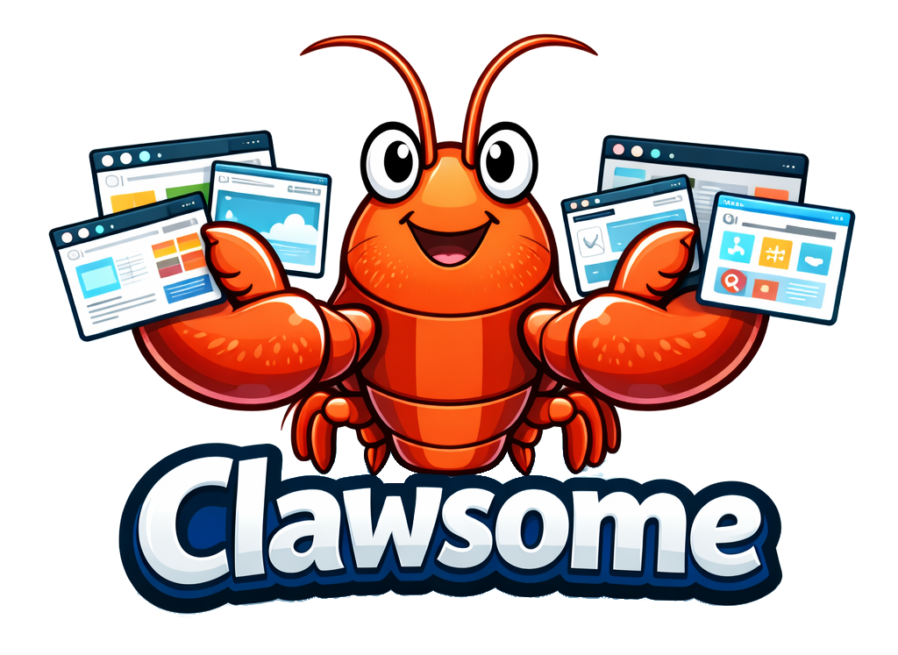
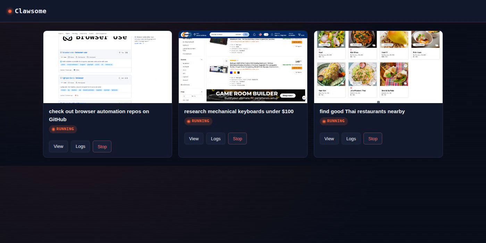
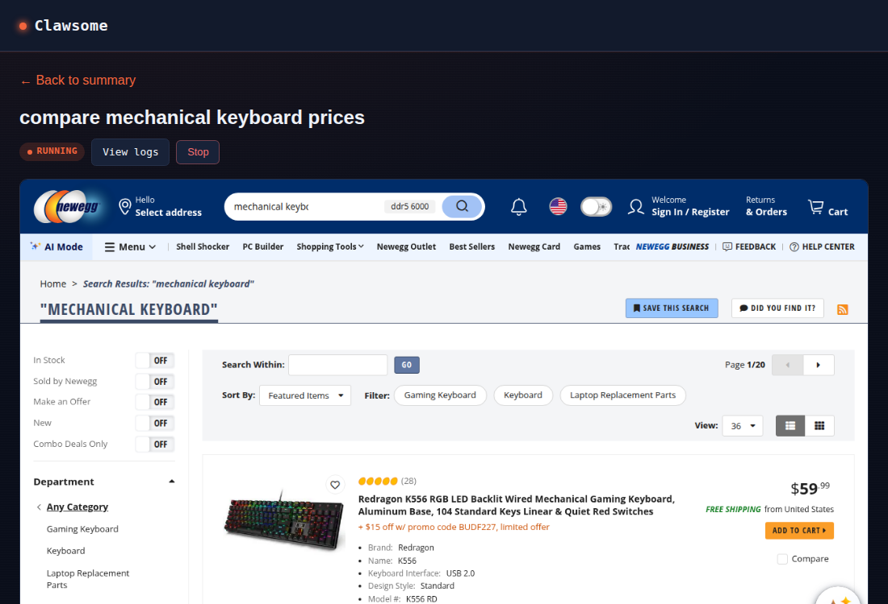
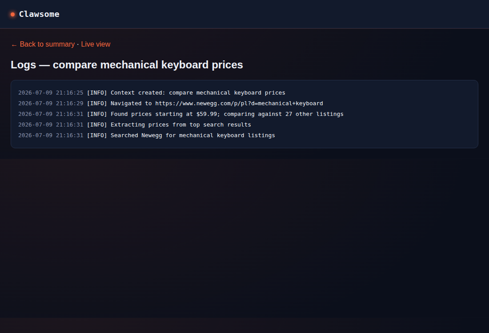

<p align="center">
  
</p>

<h3 align="center">Watch your tests and AI agents drive a real browser</h3>

<p align="center">
  <a href="https://github.com/alexanderbailey/clawsome/releases/latest"></a>
  <a href="https://github.com/alexanderbailey/clawsome/actions/workflows/ci.yml"></a>
  <a href="https://www.python.org/"></a>
  <a href="https://fastapi.tiangolo.com/"></a>
  <a href="https://playwright.dev/python/"></a>
  <a href="https://github.com/alexanderbailey/clawsome/blob/main/LICENSE"></a>
  <a href="https://github.com/astral-sh/uv"></a>
  <a href="https://github.com/alexanderbailey/clawsome/pkgs/container/clawsome"></a>
</p>

<p align="center">
  <a href="#screenshots">Screenshots</a> &middot;
  <a href="#how-it-compares">How It Compares</a> &middot;
  <a href="#quick-start">Quick Start</a> &middot;
  <a href="#rest-api">API Reference</a> &middot;
  <a href="#example-setups">Example Setups</a> &middot;
  <a href="#playwright-test-integration">Test Integration</a> &middot;
  <a href="#docker">Docker</a>
</p>

---

Clawsome lets you watch a browser work. Your test suite or an AI agent drives it, and every browser context shows up on a live dashboard — streaming screenshots, a log of what the driver says it's doing, and a screenshot history that outlives the run.

It's one self-hosted service: headless Chromium behind a REST API, with the dashboard updating over WebSocket and SSE. Profiles, screenshots and logs stay on your own disk.

**Two ways to use it:**

- **Watch an agent work.** An agent creates a context, drives it over plain HTTP, and narrates what it's doing as it goes, so you read the intent next to the screenshot of it happening. OpenClaw and Claude Code are two examples below; anything that can make an HTTP request works the same way.
- **Watch your test suite run.** Add the Playwright fixture and every test appears live, with its own screenshots and logs. The browser stays in your own test process, so a suite pointed at `localhost:3000`, a staging box behind a VPN, or an internal tool keeps working exactly as it does now — nothing moves to someone else's infrastructure.

It's built for driving things you're responsible for — your local dev server, a staging environment, an internal tool, or an account you hold — where the value is watching the work happen rather than trusting a summary of it. Whatever you point it at, it's on you to have the right to automate it, and to respect that site's terms.

Runs anywhere Python and Chromium can. No particular OS or hardware assumed.

## Screenshots

<p align="center">
  
</p>

<p align="center"><em>Summary view: every active context as a live tile, thumbnails streaming over WebSocket as each one navigates.</em></p>

<p align="center">
  
</p>

<p align="center"><em>Context detail: live screenshot, status, and controls for one browser context.</em></p>

<p align="center">
  
</p>

<p align="center"><em>Logs view: full timestamped history of an agent's narrated progress.</em></p>

<p align="center">
  
</p>

<p align="center"><em>Live in action: thumbnails refresh in real time as a context navigates, no page reload needed.</em></p>

## How It Compares

Clawsome is a small self-hosted service built around one idea: watching browser work happen. Several contexts at once as live tiles, each with a log stream the caller writes, and a screenshot history that outlives the run. It is not browser infrastructure — there is no queueing, pooling, proxy rotation or CAPTCHA handling, and it runs as a single process with a SQLite file. If you need those things, the tools below do them properly.

| Tool | What it does | Where Clawsome differs |
| --- | --- | --- |
| [Playwright MCP](https://playwright.dev/docs/getting-started-mcp) | Microsoft's MCP server: gives an agent a real browser driven from the accessibility tree, so no vision model is needed | Plain REST from any HTTP client, with MCP as one optional front end rather than the only door in; plus the dashboard, log stream and saved history |
| [Browserless](https://www.browserless.io/) | Production browser infrastructure — concurrency, queueing, a debug viewer, session replay. Self-hostable Docker image under SSPL-1.0 or a commercial licence | MIT, and much smaller: aimed at watching a handful of tasks closely rather than running many reliably |
| [Steel](https://steel.dev/) | Apache-2.0 browser API, self-hostable or hosted, with a live viewer, MP4 replay and managed stealth/CAPTCHA | Narrower scope. Many contexts on one page rather than one session at a time, and logs written by whatever is driving |
| [Browserbase](https://www.browserbase.com/) | Hosted cloud browsers with a polished live view and session replay | Self-hosted and MIT; profiles and screenshots stay on your own disk |
| [Playwright UI mode / trace viewer](https://playwright.dev/docs/test-ui-mode) | Debugging your own tests — interactively in UI mode, or after the fact from a trace | A remote live view: watch a suite running on CI, a server or a Pi from any browser, next to non-test automation on the same dashboard |

Two things follow from that shape:

- **Your existing Playwright suite shows up live** through `reporter/fixture.js`, without moving the browser off the machine already running the tests. That matters more than it sounds: a cloud browser can't reach your `localhost` dev server, your VPN-gated staging box or an internal tool without tunnelling or being self-hosted inside your network. Here the tests run where they always ran and push frames in.
- **The log stream is written by the caller**, so an agent narrates what it is about to do and you read that next to the screenshot of it happening — rather than reconstructing intent from a recording afterwards.

### When not to use it

Reach for something else if you need:

- **Scale** — many browsers at once, with queueing and pooling. Clawsome is a single process aimed at watching a handful of things closely.
- **Evasion** — proxy rotation, fingerprint management, CAPTCHA solving. There is no infrastructure for any of it here.
- **A hosted service** — Clawsome is something you run.
- **A high-fidelity or interactive view** — the live view is a frame per action plus a periodic capture, and it is read-only. It is not a video stream and you cannot click into it.
- **Post-hoc test debugging** — for "why did this fail last Tuesday", Playwright's trace viewer beats a screenshot history, and the two work fine side by side.

## Quick Start

### 1. Clone and install

```bash
git clone https://github.com/alexanderbailey/clawsome.git
cd clawsome
uv sync
uv run playwright install chromium
```

### 2. Configure environment

```bash
cp .env.example .env
```

Defaults are fine for local use (`PORT=3000`, `HOST=0.0.0.0`). Set `CLAWSOME_TOKEN` to require bearer-token authentication on the API — see [Security](#security).

### 3. Run the server

```bash
# Development (auto-restarts on file changes)
uv run uvicorn src.app:app --host "${HOST:-0.0.0.0}" --port "${PORT:-3000}" --reload

# Production — reads HOST/PORT from the environment
uv run python -m src.app
```

### 4. Verify

```bash
curl http://localhost:3000/health
# {"status":"ok"}
```

Open [http://localhost:3000/summary](http://localhost:3000/summary) for the live dashboard.

## Docker

### Run the published image

```bash
docker run -d --name clawsome \
  -p 3000:3000 \
  -v "$(pwd)/data:/app/data" \
  -v "$(pwd)/profiles:/app/profiles" \
  ghcr.io/alexanderbailey/clawsome:latest
```

The dashboard is then at [http://localhost:3000/summary](http://localhost:3000/summary). Pass configuration with `-e`, or reuse the same file compose reads:

```bash
docker run -d --name clawsome -p 3000:3000 --env-file .env \
  -v "$(pwd)/data:/app/data" -v "$(pwd)/profiles:/app/profiles" \
  ghcr.io/alexanderbailey/clawsome:latest
```

If you set `PORT` to something other than `3000`, publish that port instead.

| Tag | What it is |
| --- | --- |
| `latest` | the most recent tagged release |
| `0.1.0`, `0.1` | a release, pinned at the precision you want |
| `main` | built from every push to `main` — unreleased, opt-in |
| `sha-abc1234` | one specific commit, for rollbacks and bisecting |

Images are amd64. On ARM — a Raspberry Pi, an Apple Silicon machine — run from source for now; see [Quick Start](#quick-start).

### Build from source

```bash
cp .env.example .env
docker compose up --build
```

Data and profiles are persisted via volumes (`./data` and `./profiles`).

## Architecture

```
                         ┌──────────────────┐
   Agent / HTTP ────────►│   REST API       │
                         │   /api/contexts  │
                         └────────┬─────────┘
                                  │
                    ┌─────────────┼─────────────┐
                    ▼             ▼              ▼
              ┌──────────┐ ┌──────────┐  ┌────────────┐
              │ Browser  │ │  SQLite  │  │    SSE     │
              │ Contexts │ │   DB     │  │ Broadcast  │
              └────┬─────┘ └──────────┘  └─────┬──────┘
                   │                           │
                   ▼                           ▼
              ┌──────────┐             ┌──────────────┐
              │Playwright│             │  Dashboard   │
              │ Chromium │             │  HTMX + WS   │
              └──────────┘             └──────────────┘
```

**Context lifecycle:** Create &rarr; Navigate / Execute &rarr; Screenshot &rarr; Log &rarr; Destroy

**Context types:**
| Type | Description |
| --- | --- |
| **Ephemeral** | Fresh context in the shared browser instance (default) |
| **Persistent** | Uses a profile directory with stored cookies/sessions |
| **External** | Metadata only, no browser. Screenshots pushed via API (used by the test fixture) |

## Browser Profiles

Profiles save login sessions so Clawsome can reach authenticated pages without re-entering credentials — a staging environment behind a login, an internal admin tool, your own account on a service.

```bash
uv run python -m src.browser.create_profile staging
```

This opens a visible Chromium window. Log in manually, then close the browser. The session is saved to `./profiles/staging/`.

Use it when creating a context:

```json
{ "name": "check the invoice page renders", "profile": "staging" }
```

A saved profile is a live logged-in session on disk. Treat `./profiles/` as credentials: anyone who can reach the API can create a context with it (see [Security](#security)).

A profile can only back one live context at a time (Chromium locks the user-data directory). Creating a second context with a profile that's already in use returns `409`:

```json
{ "error": "profile_in_use", "message": "Profile 'staging' is in use by context 3f2a… ('check the invoice page renders')" }
```

The profile is released as soon as the holding context is destroyed.

## REST API

All endpoints are under `/api/`. If `CLAWSOME_TOKEN` is set, every request needs an `Authorization: Bearer <token>` header — see [Security](#security).

### Contexts

| Method | Endpoint | Body | Description |
| --- | --- | --- | --- |
| `POST` | `/api/contexts` | `{ name, profile?, external?, viewport? }` | Create a browser context |
| `GET` | `/api/contexts` | - | List all contexts |
| `GET` | `/api/contexts/:id` | - | Get context details |
| `DELETE` | `/api/contexts/:id` | - | Destroy context and free resources |

`viewport` is optional and defaults to `{ "width": 1280, "height": 720 }`. Pass e.g. `{ "width": 390, "height": 844 }` to check how a page renders on a phone-sized screen. The chosen viewport is reflected back in the context metadata.

The server records the screenshot history itself: a frame after every `goto` and `exec`, plus a periodic capture every `CLAWSOME_CAPTURE_INTERVAL` seconds (default `3`, `0` disables). History is therefore complete whether or not anyone had the dashboard open at the time, and identical frames are still skipped. External contexts are untouched — they push their own frames.

Context metadata also carries `created_at` and `last_activity`. A context with no API activity for `CLAWSOME_CONTEXT_TTL` seconds (default `1800`, `0` disables) is destroyed automatically, so a client that crashes or forgets to clean up doesn't leak a Chromium page. The expiry is written to the context's log stream, so the dashboard shows why it stopped. Any API request touching a context resets its timer.

### Browser Actions

| Method | Endpoint | Body | Description |
| --- | --- | --- | --- |
| `POST` | `/api/contexts/:id/goto` | `{ url, timeout?, waitUntil? }` | Navigate to a URL |
| `POST` | `/api/contexts/:id/exec` | `{ action, selector?, value?, script?, timeout? }` | Execute a page action |
| `GET` | `/api/contexts/:id/snapshot` | - | Get a JSON digest of the current page: URL, title, visible text, and interactive elements with selectors |

<details>
<summary>Supported exec actions</summary>

| Action | Requires | Description |
| --- | --- | --- |
| `click` | `selector` | Click an element |
| `type` | `selector`, `value` | Fill a text field |
| `select` | `selector`, `value` | Choose a dropdown option |
| `wait` | `selector` | Wait for an element to appear |
| `scroll` | - | Scroll the page. Pass `selector` to scroll an element into view, or `value` as a pixel delta or one of `top`, `bottom`, `page`, `-page`. Returns the resulting `position` |
| `press` | `value` | Press a key (e.g. `Enter`). With `selector`, focuses that element first; without, sends to the page |
| `hover` | `selector` | Hover an element, for menus that open on hover |
| `back` | - | Go back in history |
| `reload` | - | Reload the current page |
| `evaluate` | `script` | Run JavaScript in the page |
| `waitForNavigation` | - | Wait for the page URL to settle. Pass a glob in `selector` to wait for a specific URL (default `**/*`) |

All actions accept an optional `timeout` in milliseconds.

If a click opens a new tab (`target="_blank"` or `window.open`), the context follows it automatically and subsequent actions apply to the new tab. If that tab is closed, the context falls back to another open page. The browser reports a new tab a moment after the click returns (~20ms), so a request issued immediately after the click may still see the old page; the one after that will not.

</details>

Every successful `goto` and `exec` response includes the page's current `url` and `title`, so you don't need a follow-up request to see where an action left the page:

```json
{ "action": "click", "selector": "a.more-info", "url": "https://example.com/details", "title": "Details" }
```

When a `goto` or `exec` fails in the browser — a timeout, a missing selector, a navigation error — the response is a `400` with a structured body rather than a bare `500`:

```json
{
  "error": "timeout",
  "message": "Page.click: Timeout 800ms exceeded.\nCall log:\n  - waiting for locator(\"#add-to-cart\")",
  "url": "https://example.com/product"
}
```

`error` is one of `timeout`, `navigation`, or `error`; `url` is the page's current URL when the failure happened. (An unknown context is still a `404`, and an unknown action a `400` with a `detail` message.)

### Screenshots & Logs

| Method | Endpoint | Body | Description |
| --- | --- | --- | --- |
| `GET` | `/api/contexts/:id/screenshot` | - | Get current screenshot (PNG) |
| `POST` | `/api/contexts/:id/screenshot` | Raw PNG body | Upload screenshot (external contexts) |
| `GET` | `/api/contexts/:id/screenshots` | - | List saved screenshot filenames |
| `GET` | `/api/contexts/:id/screenshots/:file` | - | Get a saved screenshot |
| `GET` | `/api/contexts/:id/logs` | - | Get log entries |
| `POST` | `/api/contexts/:id/logs` | `{ level?, message }` | Append a log entry |

Saved frames are pruned so a long-running instance doesn't fill the disk: each context keeps its most recent `CLAWSOME_SCREENSHOT_LIMIT` frames (default `500`), and frames older than `CLAWSOME_SCREENSHOT_MAX_AGE_DAYS` days (default `7`) are deleted. The cap is applied as frames are written; ageing runs hourly and on startup, and covers stopped contexts too. Set either to `0` to switch that rule off, or both to keep everything.

### Example workflow

```bash
# Create a context
curl -s -X POST http://localhost:3000/api/contexts \
  -H "Content-Type: application/json" \
  -d '{"name": "example task"}'
# → {"id": "abc123", ...}

# Navigate
curl -s -X POST http://localhost:3000/api/contexts/abc123/goto \
  -H "Content-Type: application/json" \
  -d '{"url": "https://example.com"}'

# See what's on the page before acting
curl -s http://localhost:3000/api/contexts/abc123/snapshot
# → {"url": "...", "title": "...", "text": "...", "elements": [{"tag": "a", "label": "More info", "selector": "a.more-info", "href": "..."}, ...]}

# Click a link
curl -s -X POST http://localhost:3000/api/contexts/abc123/exec \
  -H "Content-Type: application/json" \
  -d '{"action": "click", "selector": "a.more-info"}'

# Take a screenshot
curl -s http://localhost:3000/api/contexts/abc123/screenshot -o shot.png

# Clean up
curl -s -X DELETE http://localhost:3000/api/contexts/abc123
```

## Security

The `/api/*` endpoints drive a real browser: `exec` runs arbitrary JavaScript in the page, and contexts can be created against any saved login profile. Treat API access as equivalent to control of the browser and everything those profiles are logged into.

**Without a token (default).** The API is unauthenticated. This is fine when the server is bound to `localhost` and only trusted local processes reach it. The default `HOST=0.0.0.0` binds to all interfaces, so anyone who can reach the port can create contexts and run `exec` — do not expose the port beyond localhost without a token (or a network-level restriction in front of it).

**With a token.** Set `CLAWSOME_TOKEN` to a strong random secret. Every `/api/*` request must then send `Authorization: Bearer <token>`; requests without a valid token get `401`. Point clients at it with the matching `CLAWSOME_TOKEN` environment variable (both the skill and `reporter/fixture.js` read it and attach the header automatically).

```bash
CLAWSOME_TOKEN=$(openssl rand -hex 32) uv run uvicorn src.app:app --host 0.0.0.0 --port 3000

curl -s http://localhost:3000/api/contexts \
  -H "Authorization: Bearer $CLAWSOME_TOKEN" \
  -H "Content-Type: application/json" \
  -d '{"name": "example task"}'
```

The token guards the API only. The dashboard pages, the SSE stream (`/sse/updates`), the screenshot WebSocket (`/ws/screenshots/:id`), and `/health` remain open, so keep the dashboard on a trusted network. Splitting read-only dashboard access from API control is tracked separately.

## Tests

The suite is end-to-end: it starts a real Clawsome server, which drives real headless Chromium, against a static site served from `tests/pages/`. Nothing is mocked and nothing reaches the public internet, so a passing run means the whole stack works together.

```bash
uv sync
uv run playwright install chromium
uv run pytest
```

Each test server gets its own `CLAWSOME_DATA_DIR`, so runs never touch the database or screenshots in your checkout. The same suite runs on every push and pull request via GitHub Actions (`.github/workflows/ci.yml`).

## Playwright Test Integration

Clawsome includes a Playwright test fixture (`reporter/fixture.js`) that streams live screenshots and test progress to the dashboard. Your tests run as normal; Clawsome just watches.

### Setup

Import `test` and `expect` from the fixture instead of `@playwright/test`:

```js
import { test, expect } from '../path/to/clawsome/reporter/fixture.js';

test('loads the homepage', async ({ page }) => {
  await page.goto('https://example.com');
  await expect(page).toHaveTitle(/Example/);
});
```

Every test automatically appears on the dashboard with live screenshots, captured every second by default (identical frames are skipped). Set `CLAWSOME_SCREENSHOT_INTERVAL_MS` to change the capture interval. When the test finishes, the context is destroyed and screenshots are preserved in the history.

### Custom log messages

```js
test('checkout flow', async ({ page, clawsome }) => {
  await page.goto('https://shop.example.com');
  await clawsome.log('Navigated to shop');

  await page.click('.add-to-cart');
  await clawsome.log('Added item to cart');
});
```

### Configuration

Set `CLAWSOME_URL` if the server runs on a different host:

```bash
CLAWSOME_URL=http://192.168.1.50:3000 npx playwright test
```

If Clawsome is unreachable, tests run normally with no errors or side effects.

## Dashboard

| Route | Description |
| --- | --- |
| `/summary` | Grid of active contexts with live thumbnails (auto-updates via SSE + WebSocket) |
| `/history` | Grid of stopped contexts with last screenshot, paginated |
| `/context/:id` | Live screenshot view with metadata, mini log stream, and screenshot history |
| `/logs/:id` | Full scrolling log viewer |
| `/sse/updates` | Raw SSE event stream |

**SSE events:** `context:created`, `context:destroyed`, `context:updated`, `log:new`

## Example Setups

The API is generic, but here's what you can do with it:

- **Phone → agent → screen.** Message your agent from your phone and watch the task run live on any screen with the dashboard open, whether that's a second monitor or a Raspberry Pi plugged into the TV. You see every click as it happens without touching a laptop.
- **A second pair of eyes on your coding agent.** Mid-session, ask Claude Code to "log into staging with the `staging` profile and check the new invoice page renders". It drives the browser through the API while you watch on `/summary`, instead of trusting a text summary after the fact.
- **CI test monitoring.** Point `reporter/fixture.js` at a Clawsome instance and open `/summary` during a deploy. Every Playwright test in the suite shows up as a live tile with screenshots, so a flaky test is visible while it happens instead of buried in a CI log afterward.

## AI Agent Integration

Clawsome has no dependency on any particular agent: it's a REST API, and anything that can make an HTTP request can drive it. There are two ready-made integrations — an MCP server and a skill — and neither is required.

### MCP server

For agents that speak MCP, `src/mcp_server.py` exposes the API as tools: `create_context`, `goto`, `snapshot`, `act`, `screenshot`, `log`, `list_contexts` and `destroy_context`. Screenshots come back as images the agent can actually look at, rather than a file path.

It's a thin client over the REST API, so **start Clawsome first**, then register the server:

```bash
claude mcp add clawsome -- uv run --directory /path/to/clawsome --extra mcp python -m src.mcp_server
```

For a non-default address or a token-protected instance, pass them through:

```bash
claude mcp add clawsome \
  --env CLAWSOME_URL=http://192.168.1.50:3000 \
  --env CLAWSOME_TOKEN=your-token \
  -- uv run --directory /path/to/clawsome --extra mcp python -m src.mcp_server
```

The MCP dependency is optional and not installed by default — `--extra mcp` (or `uv sync --extra mcp`) pulls it in.

### Skill

For agents that support skills, `skill/` contains a ready-made one that teaches the full workflow (create a context, navigate, act, log progress, clean up). It needs only `curl`, so it's the dependency-free option. The same file works for OpenClaw, Claude Code, and anything else that reads the SKILL.md format:

```bash
# OpenClaw
cp -r skill/ ~/.openclaw/workspace/skills/clawsome/

# Claude Code, this project only
cp -r skill/ .claude/skills/clawsome/

# Claude Code, all projects
cp -r skill/ ~/.claude/skills/clawsome/
```

If Clawsome runs somewhere other than `http://localhost:3000`, set `CLAWSOME_URL` in the agent's environment — the skill reads it and falls back to the default when it's unset, so there's no need to edit `skill/SKILL.md`. Set `CLAWSOME_TOKEN` too if the instance requires a token:

```bash
export CLAWSOME_URL=http://192.168.1.50:3000
export CLAWSOME_TOKEN=your-token   # only if the server sets one
```

This is the same pair of variables `reporter/fixture.js` uses.

Once installed, the reliable way to invoke it is by name: say "use clawsome to check the checkout page", or type `/clawsome` in Claude Code. Agents can also pick the skill up on their own when a request clearly needs a live browser, but that matching is best effort, so name it when it matters.

Neither integration is a requirement. Any agent can be pointed at the [REST API](#rest-api) reference above and drive Clawsome directly.

## Releases

Tagged releases are on the [releases page](https://github.com/alexanderbailey/clawsome/releases), and what changed in each one is in [CHANGELOG.md](CHANGELOG.md). Versions follow [semver](https://semver.org/); before `1.0.0` the API may still change between minor versions, and anything breaking is called out in the changelog.

## License

[MIT](LICENSE)
